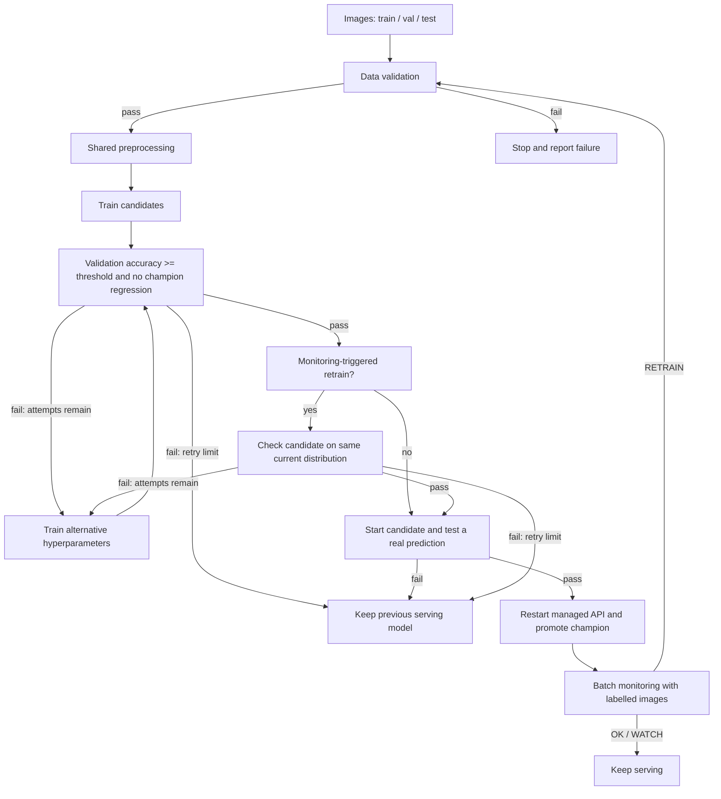

# Automatic training, retraining, and local deployment

## What is implemented

`09_auto_pipeline.py` connects the team's numbered steps:



The diagram's validation/current-data gates are both required during a monitoring
retrain. A successful validation result alone cannot bypass the current-data gate.
API outages are operational failures; they do not trigger model retraining.

## Important integration fix

The merged preprocessing step produced 836 features, while serving and monitoring
used `common.extract_features` (2,276 features). Preprocessing now imports that
same function, eliminating training/serving dimensional mismatch. Its CSV format
and the team's existing training/registry implementation are retained.

## Run manually once

Activate the `project_ml` Python environment and install monitoring dependencies.
From the repository root:

```bash
python scripts/09_auto_pipeline.py --mode train
python scripts/09_auto_pipeline.py --mode monitor
```

The first command automatically runs validation, preprocessing, training, gates,
a real-image prediction smoke test, and local deployment. Default maximum is two
training attempts: initial `logreg,random_forest`, then alternative parameters
`logreg_C1.0,rf_n300_depthNone`. Use `--max-attempts` (1..5) to set a finite limit.
`FORCE_PROMOTE` is disabled in the automatic flow. Failed data validation and
operational errors stop immediately instead of blindly retrying training.

The managed API uses http://127.0.0.1:8001. It does not stop the team's existing
API on 8000. To use 8000, first stop that API deliberately and pass `--port 8000`.
Prometheus currently scrapes 8000; update its target to 8001 if this managed API
becomes the chosen serving deployment, then restart Prometheus. Deployment has
a brief restart window; this is not a zero-downtime production deployment.

An immutable candidate version is smoke-tested on a temporary port before the
managed API is replaced. Startup failure restores the previously managed
version. Alias-promotion failure also restores the registry alias. PID identity
is checked through `/health` before the controller signals an existing process.
An unmanaged process on the chosen port is never stopped.

Runtime state and evidence are under `reports/auto_pipeline/`, ignored by Git.
Processed training CSVs are isolated there; existing processed_data, reports,
monitoring_data and their files remain intact. Use the same `--state-dir` and
MLflow tracking configuration for subsequent monitoring runs. The previous
registered champion remains unchanged when training/candidate gates fail.

## Monitoring and automatic triggers

Monitoring recomputes predictions and drift/performance for the actually deployed
immutable model version, and checks that registry and serving agree. It uses
validation as reference and test as current data: an offline classroom demo,
not live production labels. Real online performance monitoring requires a new,
labelled current-data feed; unlabelled requests alone cannot measure accuracy.

`OK` and `WATCH` do not train. `RETRAIN` invokes validation/preprocessing/training
and checks the candidate on the same current distribution before deployment.
A one-hour cooldown prevents repeated retraining across scheduled invocations;
monitoring still runs during cooldown. A file lock serializes local invocations.
`--simulate-drift` makes only monitoring current images darker and blurred; it
never changes training images or lowers the gate to force a deployment. If the
candidate still performs poorly, the retry limit retains the old model and exits
with code 2. Errors exit 1; success/OK/WATCH/cooldown exit 0.

## CI versus CD: do not claim all triggers are active

`.github/workflows/pipeline-ci.yml` runs the failure-path tests and lint on pull
requests and pushes to main/feature branches. It does not deploy, access the full
dataset, or run on a private machine. Local tests have been run; GitHub CI results
can only be confirmed after pushing these changes.

`docs/workflow-proposals/pipeline-runtime.yml.example` is a **review draft**, not
an installed workflow. It proposes training/deployment on main changes and
monitoring every 15 minutes. It requires:

1. The team's approval to run repeated training and deployment on their machine.
2. A trusted persistent self-hosted runner labelled `project-ml`, with the Python
   environment, real dataset and writable MLflow database/artifacts available.
3. A first successful `train` invocation in that runner's persistent workspace.
4. Installation under `.github/workflows/pipeline-runtime.yml` and repository
   variable `ENABLE_AUTO_PIPELINE=true` after review.

Never run untrusted pull-request code on this runner. Keep checkout runtime state
persistent (`clean: false`), and use the same registry/workspace across jobs.
Monitoring schedules run from main only, not from this feature branch.
The runner's Python must point to the prepared environment. No datasets, models,
credentials or monitoring CSVs are uploaded as evidence artifacts.

## Evidence for presentation

Present both real successful and unsuccessful executions. `events.json`,
`train-N.json`, `result.json`, serving logs and generated monitoring reports in
each run directory show what happened; `serving.json` shows the active immutable
version. Show the retry limit as a correct protective outcome, not as successful
recovery. Tests use mocks for operational failure/rollback and must be labelled
as tests; real training demos use actual leaf images and isolated MLflow state.

Training on the same data is not a guarantee that drift will be repaired. New
representative labelled training data may be needed. The pipeline never promotes
a failing candidate just to make the demonstration appear successful.

## Enabled local controller

`10_pipeline_watch.py` detects source and image-content changes (SHA-256).
It runs the local CI gate before training on a change. When unchanged, it invokes
monitoring every 900 seconds. Run in the same Python environment, registry,
state directory and dataset as the managed API:

```bash
python scripts/10_pipeline_watch.py --data-dir dataset/tomato --state-dir reports/auto_pipeline
```

The controller must remain running and the Mac must be awake. It resumes normal
monitoring after a bounded retrain failure; current-data gating and the one-hour
cooldown still apply. It does not pull or merge peer code into the working tree.
`watch-events.jsonl` records whether each run was triggered by code/data change
or by the timer. `--run-once` supports repeatable integration tests.

The GitHub CI workflow now runs an additional real end-to-end test: synthetic
images -> validation -> shared preprocessing -> baseline rejection -> automatic
Random Forest retrain -> gate -> ephemeral API deployment -> serving tests. It
uploads only event/quality-gate evidence. Synthetic-image scores are not leaf
classification accuracy; the separate local demo uses real leaf images.
GitHub-hosted deployment is ephemeral; the local controller manages the
persistent API on the Mac. Shared self-hosted scheduling remains a draft because
this GitHub account has write access but no repository administration access.
